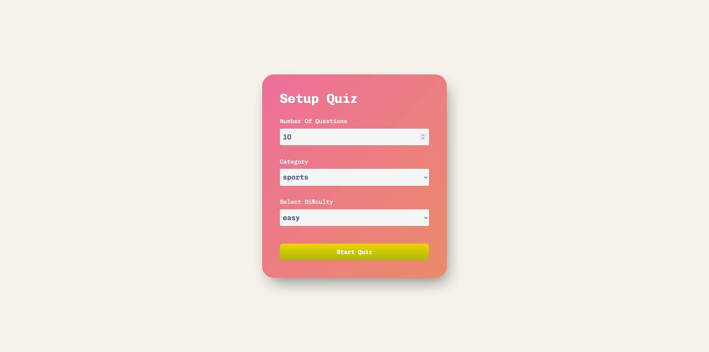

# Quiz

## Built with

- React
- Vite
- useState Hook
- CSS
- Responsive Design
- Axios
- GlobalContext

## Users should be able to:

- Choose the amount of questions they want to answer
- Select the category of questions they want to answer (Politics, History, Sports)
- Choose the difficulty of the questions they want to answer (Easy, Medium, Hard)
- Start the quiz and see a series of questions
- Skip questions if they don't know the answer
- See their score at the end of the quiz
- Restart the quiz and play again

## Links

- Live Site URL: [Quiz](https://quiz-ekizashvilit.netlify.app/)
